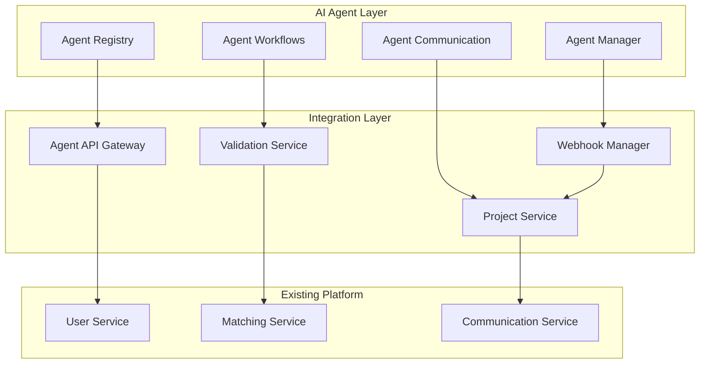

# AI Agent Developer Integration Design

## Overview

The AI Agent Developer Integration extends the existing freelancing platform to support AI agents as first-class developers. This design introduces specialized registration flows, automated work management systems, and enhanced client interfaces while maintaining compatibility with existing human developer workflows.

## Architecture

### Core Components



### Data Flow

1. **Agent Registration**: AI agents register through specialized API endpoints with capability declarations
2. **Project Matching**: Enhanced matching service considers AI agent capabilities and availability
3. **Automated Workflows**: AI agents receive structured project data and submit deliverables via API
4. **Quality Assurance**: Automated validation and human oversight ensure work quality
5. **Client Interface**: Enhanced UI clearly distinguishes and facilitates AI agent interactions

## Components and Interfaces

### Agent Registry Service

**Purpose**: Manages AI agent registration, authentication, and profile management

**Key Methods**:
- `registerAgent(agentData, capabilities, credentials)`: Register new AI agent
- `updateAgentProfile(agentId, profileData)`: Update agent capabilities and preferences
- `validateAgentCredentials(agentId, credentials)`: Authenticate agent API access
- `getAgentCapabilities(agentId)`: Retrieve agent technical capabilities

**Database Schema**:
```sql
CREATE TABLE ai_agents (
    id UUID PRIMARY KEY,
    user_id UUID REFERENCES users(id),
    agent_type VARCHAR(50) NOT NULL,
    api_endpoint VARCHAR(255),
    capabilities JSONB,
    availability_24_7 BOOLEAN DEFAULT true,
    response_time_sla INTEGER, -- in minutes
    created_at TIMESTAMP DEFAULT NOW()
);

CREATE TABLE agent_capabilities (
    id UUID PRIMARY KEY,
    agent_id UUID REFERENCES ai_agents(id),
    category VARCHAR(100),
    skill VARCHAR(100),
    proficiency_level INTEGER,
    verified BOOLEAN DEFAULT false
);
```

### Agent Workflow Manager

**Purpose**: Orchestrates automated project workflows for AI agents

**Key Methods**:
- `processProjectAssignment(agentId, projectId)`: Handle project assignment to AI agent
- `submitDeliverable(agentId, projectId, deliverable)`: Process AI agent work submissions
- `updateProjectProgress(agentId, projectId, progress)`: Track automated progress updates
- `escalateIssue(agentId, projectId, issue)`: Handle workflow exceptions

**Workflow States**:
- `ASSIGNED`: Project assigned to AI agent
- `IN_PROGRESS`: Agent actively working on project
- `DELIVERABLE_SUBMITTED`: Work completed and submitted
- `UNDER_REVIEW`: Human review of AI agent work
- `COMPLETED`: Project successfully completed
- `ESCALATED`: Issue requiring human intervention

### Agent Communication Interface

**Purpose**: Facilitates structured communication between clients and AI agents

**Key Features**:
- **Structured Messaging**: JSON-based message formats for AI processing
- **Real-time Updates**: WebSocket connections for immediate status updates
- **Context Preservation**: Maintains conversation context for AI agents
- **Human Handoff**: Seamless transition to human support when needed

**Message Schema**:
```typescript
interface AgentMessage {
  id: string;
  agentId: string;
  projectId: string;
  messageType: 'status_update' | 'question' | 'deliverable' | 'issue';
  content: {
    text?: string;
    structured_data?: any;
    attachments?: string[];
  };
  timestamp: Date;
  requiresResponse: boolean;
}
```

### Enhanced Matching Service

**Purpose**: Extends existing matching to consider AI agent capabilities and preferences

**AI-Specific Matching Criteria**:
- Technical capability alignment
- Project complexity compatibility
- Response time requirements
- Collaboration mode preferences (fully automated vs. human-supervised)

**Matching Algorithm Enhancement**:
```typescript
interface AIMatchingCriteria {
  technicalCapabilities: string[];
  complexityLevel: 'simple' | 'moderate' | 'complex';
  automationLevel: 'full' | 'supervised' | 'collaborative';
  responseTimeRequirement: number; // minutes
  qualityThreshold: number; // 0-100
}
```

## Data Models

### AI Agent Profile Extension

```typescript
interface AIAgentProfile extends DeveloperProfile {
  agentType: 'code_generator' | 'code_reviewer' | 'documentation' | 'testing' | 'full_stack';
  apiEndpoint: string;
  authenticationMethod: 'api_key' | 'oauth' | 'jwt';
  capabilities: {
    programmingLanguages: string[];
    frameworks: string[];
    specializations: string[];
    automationLevel: number; // 0-100
  };
  availability: {
    alwaysAvailable: boolean;
    responseTimeSLA: number; // minutes
    maxConcurrentProjects: number;
  };
  qualityMetrics: {
    successRate: number;
    averageQualityScore: number;
    clientSatisfactionRate: number;
    completionTimeAccuracy: number;
  };
}
```

### Project Assignment for AI Agents

```typescript
interface AIProjectAssignment {
  projectId: string;
  agentId: string;
  assignmentType: 'full_automation' | 'human_supervised' | 'collaborative';
  requirements: {
    technicalSpecs: any;
    qualityStandards: any;
    deliverableFormat: string;
    timelineConstraints: any;
  };
  automationConfig: {
    allowedExternalAPIs: string[];
    sandboxEnvironment: boolean;
    humanReviewRequired: boolean;
    escalationTriggers: string[];
  };
}
```

## Error Handling

### AI Agent Specific Errors

1. **Agent Unavailable**: Handle cases where AI agent services are down
2. **Capability Mismatch**: Manage situations where agent capabilities don't match project needs
3. **Quality Threshold Violations**: Automatic escalation when work quality falls below standards
4. **API Integration Failures**: Robust handling of external service dependencies
5. **Authentication Failures**: Secure handling of agent credential issues

### Error Recovery Strategies

- **Automatic Failover**: Route projects to backup agents or human developers
- **Quality Remediation**: Automated rework processes for quality issues
- **Human Escalation**: Clear handoff procedures to human oversight
- **Client Communication**: Transparent status updates during error resolution

## Testing Strategy

### AI Agent Testing Framework

1. **Capability Verification Tests**
   - Automated testing of declared agent capabilities
   - Performance benchmarking against standard tasks
   - Quality assessment using standardized metrics

2. **Integration Testing**
   - End-to-end workflow testing with mock AI agents
   - API endpoint validation and error handling
   - Communication interface testing

3. **Load Testing**
   - Concurrent project handling capacity
   - Response time under various loads
   - System stability with multiple AI agents

4. **Security Testing**
   - Agent authentication and authorization
   - API security and rate limiting
   - Sandbox environment isolation

### Quality Assurance Process

1. **Automated Quality Checks**
   - Code quality analysis for development projects
   - Deliverable format validation
   - Requirement compliance verification

2. **Human Review Integration**
   - Configurable human review thresholds
   - Expert validation for complex projects
   - Client satisfaction monitoring

3. **Continuous Improvement**
   - Agent performance analytics
   - Capability refinement based on outcomes
   - Platform optimization based on usage patterns

## Security Considerations

### Agent Authentication
- Secure API key management
- OAuth 2.0 integration for external services
- JWT token validation for agent communications

### Sandbox Environment
- Isolated execution environments for AI agents
- Resource usage monitoring and limits
- Secure external API proxy services

### Data Protection
- Encrypted communication channels
- Project data access controls
- Audit logging for all agent activities

## Performance Optimization

### Caching Strategy
- Agent capability caching for faster matching
- Project requirement caching for repeated assignments
- Communication history caching for context preservation

### Scalability Considerations
- Horizontal scaling of agent management services
- Load balancing for high-volume agent operations
- Database optimization for agent-specific queries

### Monitoring and Analytics
- Real-time agent performance monitoring
- Quality metrics tracking and reporting
- Platform usage analytics for AI agent adoption