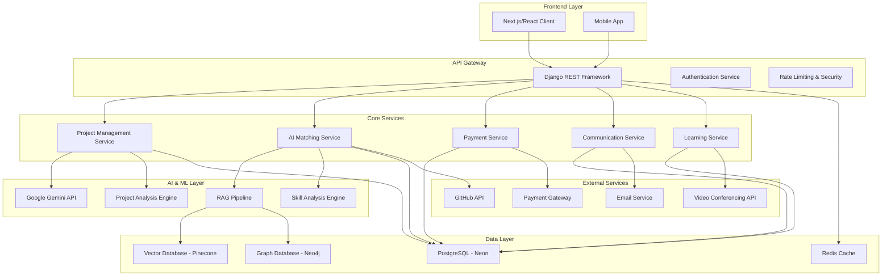
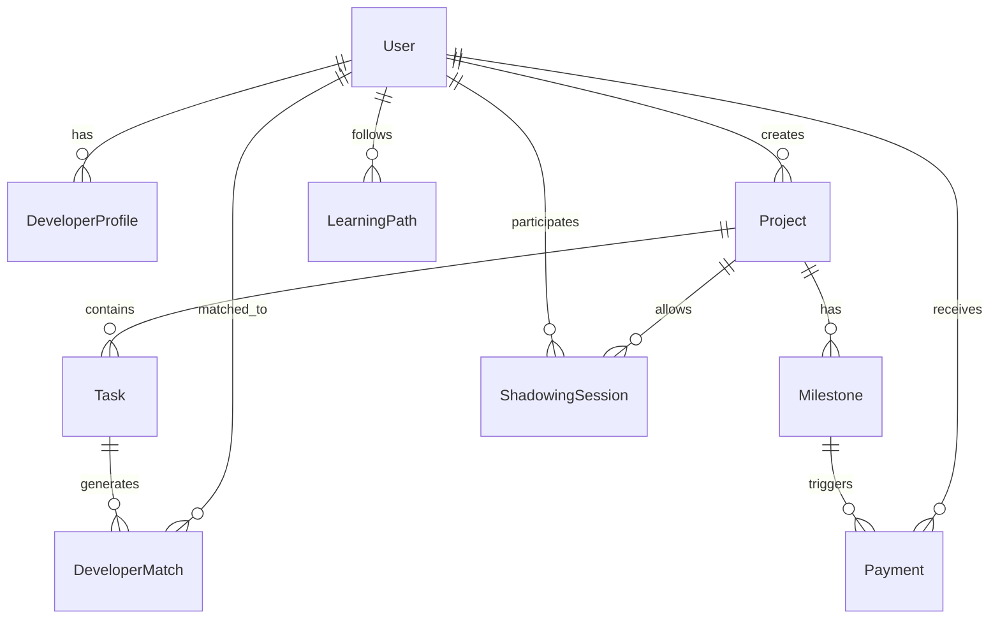

# Design Document

## Overview

This document outlines the technical design for an AI-powered freelancing platform that revolutionizes software development collaboration through task-based hiring, intelligent matching, and automated project management. The platform leverages Google Gemini for AI capabilities, Django for backend services, PostgreSQL (Neon) for data persistence, and a hybrid RAG pipeline for intelligent developer-project matching.

## Architecture

### High-Level Architecture



### System Components

#### 1. Django Backend Architecture

**Core Django Apps:**
- `authentication/` - User management and OAuth integration
- `projects/` - Project lifecycle management
- `matching/` - AI-powered developer matching
- `payments/` - Milestone-based payment processing
- `communications/` - Chat and messaging system
- `learning/` - Personalized learning platform
- `community/` - Events and collaboration features
- `marketplace/` - Featured projects and developers

#### 2. Hybrid RAG Pipeline

**Vector Database Component (Pinecone):**
- Developer skill embeddings
- Project requirement embeddings
- GitHub repository analysis embeddings
- Resume and experience embeddings

**Graph Database Component (Neo4j):**
- Skill-technology relationships
- Developer-project history connections
- Mentorship and collaboration networks
- Learning path dependencies

**Hybrid Matching Algorithm:**
```python
def hybrid_match(project_requirements, available_developers):
    # Vector similarity for semantic matching
    vector_scores = vector_db.similarity_search(
        project_requirements, 
        developer_profiles
    )
    
    # Graph traversal for relationship context
    graph_scores = graph_db.relationship_analysis(
        required_skills,
        developer_networks
    )
    
    # Weighted combination
    final_scores = combine_scores(vector_scores, graph_scores)
    return ranked_developers
```

## Components and Interfaces

### 1. AI Matching Service

**Interface:**
```python
class AIMatchingService:
    def analyze_project(self, project_description: str) -> ProjectAnalysis
    def match_developers(self, project_tasks: List[Task]) -> List[DeveloperMatch]
    def suggest_team_structure(self, project_complexity: str) -> TeamStructure
    def update_developer_profile(self, github_data: dict, resume_data: dict) -> None
```

**Implementation Details:**
- Integrates with Google Gemini for natural language understanding
- Uses hybrid RAG pipeline for intelligent matching
- Implements real-time scoring algorithms
- Maintains developer availability tracking

### 2. Project Management Service

**Interface:**
```python
class ProjectManagementService:
    def create_project(self, client_id: str, description: str) -> Project
    def generate_task_breakdown(self, project: Project) -> List[Task]
    def assign_senior_developer(self, project: Project) -> Assignment
    def approve_proposal(self, project_id: str, approver_id: str) -> bool
    def track_milestone_progress(self, project_id: str) -> MilestoneStatus
```

### 3. Payment Service

**Interface:**
```python
class PaymentService:
    def calculate_milestone_payment(self, project_id: str) -> PaymentAmount
    def process_milestone_payment(self, project_id: str) -> PaymentResult
    def distribute_team_payments(self, project_id: str, amount: Decimal) -> None
    def handle_payment_disputes(self, dispute: PaymentDispute) -> Resolution
```

### 4. Learning Service

**Interface:**
```python
class LearningService:
    def generate_learning_path(self, developer_id: str) -> LearningPath
    def recommend_courses(self, skills: List[str], market_trends: dict) -> List[Course]
    def track_learning_progress(self, developer_id: str, course_id: str) -> Progress
    def award_profile_credits(self, developer_id: str, achievement: Achievement) -> None
```

## Data Models

### Core Models

```python
# User Management
class User(models.Model):
    id = models.UUIDField(primary_key=True, default=uuid.uuid4)
    email = models.EmailField(unique=True)
    role = models.CharField(choices=[('client', 'Client'), ('developer', 'Developer'), ('admin', 'Admin')])
    github_username = models.CharField(max_length=100, null=True, blank=True)
    created_at = models.DateTimeField(auto_now_add=True)
    is_verified = models.BooleanField(default=False)

class DeveloperProfile(models.Model):
    user = models.OneToOneField(User, on_delete=models.CASCADE)
    skills = models.JSONField(default=list)
    experience_level = models.CharField(max_length=20)
    hourly_rate = models.DecimalField(max_digits=10, decimal_places=2)
    availability_status = models.CharField(max_length=20, default='available')
    github_analysis = models.JSONField(default=dict)
    skill_embeddings = models.JSONField(default=list)
    reputation_score = models.FloatField(default=0.0)

# Project Management
class Project(models.Model):
    id = models.UUIDField(primary_key=True, default=uuid.uuid4)
    client = models.ForeignKey(User, on_delete=models.CASCADE)
    title = models.CharField(max_length=200)
    description = models.TextField()
    ai_analysis = models.JSONField(default=dict)
    status = models.CharField(max_length=20, default='analyzing')
    budget_estimate = models.DecimalField(max_digits=12, decimal_places=2)
    timeline_estimate = models.DurationField()
    senior_developer = models.ForeignKey(User, null=True, on_delete=models.SET_NULL)
    created_at = models.DateTimeField(auto_now_add=True)

class Task(models.Model):
    id = models.UUIDField(primary_key=True, default=uuid.uuid4)
    project = models.ForeignKey(Project, on_delete=models.CASCADE)
    title = models.CharField(max_length=200)
    description = models.TextField()
    required_skills = models.JSONField(default=list)
    estimated_hours = models.IntegerField()
    priority = models.IntegerField(default=1)
    dependencies = models.ManyToManyField('self', blank=True)
    assigned_developer = models.ForeignKey(User, null=True, on_delete=models.SET_NULL)
    status = models.CharField(max_length=20, default='pending')
    completion_percentage = models.IntegerField(default=0)

# Matching and Assignment
class DeveloperMatch(models.Model):
    task = models.ForeignKey(Task, on_delete=models.CASCADE)
    developer = models.ForeignKey(User, on_delete=models.CASCADE)
    match_score = models.FloatField()
    vector_score = models.FloatField()
    graph_score = models.FloatField()
    availability_score = models.FloatField()
    created_at = models.DateTimeField(auto_now_add=True)

# Payment System
class Milestone(models.Model):
    project = models.ForeignKey(Project, on_delete=models.CASCADE)
    percentage = models.IntegerField()  # 25, 50, 75, 100
    amount = models.DecimalField(max_digits=12, decimal_places=2)
    status = models.CharField(max_length=20, default='pending')
    due_date = models.DateTimeField()
    paid_date = models.DateTimeField(null=True)

class Payment(models.Model):
    milestone = models.ForeignKey(Milestone, on_delete=models.CASCADE)
    developer = models.ForeignKey(User, on_delete=models.CASCADE)
    amount = models.DecimalField(max_digits=10, decimal_places=2)
    status = models.CharField(max_length=20, default='pending')
    processed_at = models.DateTimeField(null=True)

# Learning System
class LearningPath(models.Model):
    developer = models.ForeignKey(User, on_delete=models.CASCADE)
    current_skills = models.JSONField(default=list)
    target_skills = models.JSONField(default=list)
    recommended_courses = models.JSONField(default=list)
    progress_percentage = models.IntegerField(default=0)
    created_at = models.DateTimeField(auto_now_add=True)

class ShadowingSession(models.Model):
    student = models.ForeignKey(User, on_delete=models.CASCADE, related_name='shadowing_sessions')
    project = models.ForeignKey(Project, on_delete=models.CASCADE)
    mentor = models.ForeignKey(User, on_delete=models.CASCADE, related_name='mentoring_sessions')
    start_date = models.DateTimeField()
    end_date = models.DateTimeField()
    learning_credits_awarded = models.IntegerField(default=0)
    nda_signed = models.BooleanField(default=False)
```

### Database Schema Relationships



## Error Handling

### Error Categories and Strategies

1. **AI Service Failures**
   - Fallback to cached analysis results
   - Graceful degradation to manual matching
   - Retry mechanisms with exponential backoff

2. **Payment Processing Errors**
   - Transaction rollback mechanisms
   - Automated retry for temporary failures
   - Manual intervention workflows for complex issues

3. **External API Failures**
   - Circuit breaker patterns for GitHub API
   - Cached data fallbacks
   - Alternative data sources when available

4. **Database Connection Issues**
   - Connection pooling and retry logic
   - Read replica fallbacks
   - Graceful service degradation

### Error Response Format

```python
class APIError(Exception):
    def __init__(self, message: str, error_code: str, status_code: int = 400):
        self.message = message
        self.error_code = error_code
        self.status_code = status_code

# Standard error response
{
    "error": {
        "code": "MATCHING_SERVICE_UNAVAILABLE",
        "message": "Developer matching service is temporarily unavailable",
        "details": "Fallback to cached recommendations",
        "timestamp": "2024-01-15T10:30:00Z"
    }
}
```

## Testing Strategy

### Unit Testing
- Django model validation and business logic
- AI service integration mocking
- Payment calculation algorithms
- Matching algorithm components

### Integration Testing
- End-to-end project creation workflow
- Payment processing pipeline
- Real-time matching system
- External API integrations

### Performance Testing
- Database query optimization
- RAG pipeline response times
- Concurrent user load testing
- Real-time matching scalability

### Security Testing
- Authentication and authorization
- Payment security validation
- Data privacy compliance
- API security scanning

### Test Data Management
```python
# Factory pattern for test data
class ProjectFactory:
    @staticmethod
    def create_test_project(complexity='medium'):
        return Project.objects.create(
            title=f"Test Project - {complexity}",
            description=f"Test project with {complexity} complexity",
            client=UserFactory.create_client(),
            budget_estimate=Decimal('5000.00')
        )

class DeveloperFactory:
    @staticmethod
    def create_test_developer(skills=['Python', 'Django']):
        user = User.objects.create(
            email=f"dev{random.randint(1000,9999)}@test.com",
            role='developer'
        )
        DeveloperProfile.objects.create(
            user=user,
            skills=skills,
            experience_level='mid',
            hourly_rate=Decimal('75.00')
        )
        return user
```

### Continuous Integration Pipeline
1. **Code Quality Checks**: Flake8, Black, isort
2. **Security Scanning**: Bandit, Safety
3. **Unit Tests**: pytest with coverage reporting
4. **Integration Tests**: Django test client
5. **Performance Tests**: Locust load testing
6. **Database Migration Tests**: Django migration validation