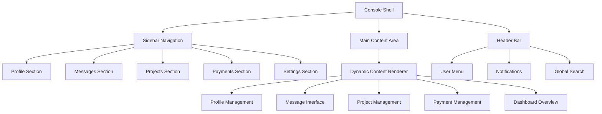

# Design Document

## Overview

The unified console dashboard is a comprehensive single-page application that consolidates all platform functionality into one streamlined interface. Instead of navigating between separate pages for dashboard, profile, messages, projects, and payments, users will have everything accessible from a central console with a sidebar navigation and dynamic main content area.

## Architecture

### High-Level Architecture



### Component Hierarchy

```
UnifiedConsole
├── ConsoleHeader
│   ├── GlobalSearch
│   ├── NotificationCenter
│   └── UserMenu
├── ConsoleSidebar
│   ├── NavigationMenu
│   ├── QuickActions
│   └── StatusIndicators
└── ConsoleMainContent
    ├── DashboardOverview
    ├── ProfileManager
    ├── MessageCenter
    ├── ProjectManager
    └── PaymentCenter
```

## Components and Interfaces

### 1. Console Shell Component

**Purpose**: Main container that manages the overall layout and state

**Key Features**:
- Responsive layout with collapsible sidebar
- State management for current section
- Context preservation across section switches
- Real-time updates and notifications

**Props Interface**:
```typescript
interface ConsoleShellProps {
  user: User;
  profile: UserProfile;
  initialSection?: string;
  onSectionChange?: (section: string) => void;
}
```

### 2. Sidebar Navigation Component

**Purpose**: Primary navigation interface with section switching

**Key Features**:
- Collapsible/expandable sidebar
- Active section highlighting
- Notification badges for unread items
- Quick action buttons
- Responsive behavior for mobile

**Navigation Sections**:
- Dashboard Overview
- Profile Management
- Messages & Communication
- Project Management
- Payment & Billing
- Settings & Preferences

### 3. Main Content Area Component

**Purpose**: Dynamic content renderer based on selected section

**Key Features**:
- Smooth transitions between sections
- State preservation for forms and data
- Loading states and error handling
- Responsive content layout

**Content Sections**:

#### Dashboard Overview
- Key metrics and statistics
- Recent activity feed
- Quick action cards
- Project status summaries
- Upcoming deadlines and notifications

#### Profile Management
- Editable profile information
- Skills and expertise management
- Portfolio and work samples
- Account settings and preferences

#### Message Center
- Conversation list with search/filter
- Real-time message interface
- File sharing and attachments
- Message history and archiving

#### Project Management
- Project list with filtering/sorting
- Project creation and editing
- Team collaboration tools
- Progress tracking and milestones

#### Payment Center
- Payment history and invoices
- Payment method management
- Billing information
- Transaction details and disputes

### 4. Header Bar Component

**Purpose**: Global utilities and user information

**Key Features**:
- Global search functionality
- Notification center with real-time updates
- User menu with quick actions
- Breadcrumb navigation for context

## Data Models

### Console State Model
```typescript
interface ConsoleState {
  currentSection: string;
  sidebarCollapsed: boolean;
  notifications: Notification[];
  searchQuery: string;
  userPreferences: UserPreferences;
  sectionStates: Record<string, any>;
}
```

### Navigation Section Model
```typescript
interface NavigationSection {
  id: string;
  label: string;
  icon: string;
  component: React.ComponentType;
  badge?: number;
  permissions?: string[];
  quickActions?: QuickAction[];
}
```

### User Context Model
```typescript
interface UserContext {
  user: User;
  profile: UserProfile;
  permissions: string[];
  preferences: UserPreferences;
  activeProjects: Project[];
  unreadMessages: number;
  notifications: Notification[];
}
```

## Error Handling

### Error Boundaries
- Section-level error boundaries to prevent full console crashes
- Graceful degradation when individual sections fail
- Error reporting and recovery mechanisms

### Network Error Handling
- Offline mode detection and messaging
- Retry mechanisms for failed requests
- Optimistic updates with rollback capability

### Validation and Form Errors
- Real-time form validation
- Clear error messaging and guidance
- Prevention of data loss during errors

## Testing Strategy

### Unit Testing
- Individual component testing with Jest and React Testing Library
- State management testing for console state
- Navigation and routing logic testing

### Integration Testing
- Section switching and state preservation
- Real-time updates and notifications
- Cross-section data consistency

### End-to-End Testing
- Complete user workflows across sections
- Responsive behavior testing
- Performance testing under load

### Accessibility Testing
- Keyboard navigation testing
- Screen reader compatibility
- Color contrast and visual accessibility

## Performance Considerations

### Code Splitting
- Lazy loading of section components
- Dynamic imports for heavy features
- Bundle optimization and tree shaking

### State Management
- Efficient state updates and re-renders
- Memoization of expensive computations
- Optimized data fetching and caching

### Real-time Updates
- WebSocket connection management
- Efficient update batching
- Memory leak prevention

## Security Considerations

### Authentication and Authorization
- Session management and token refresh
- Role-based access control for sections
- Secure API communication

### Data Protection
- Input sanitization and validation
- XSS and CSRF protection
- Secure storage of sensitive data

### Privacy
- User data encryption
- Audit logging for sensitive actions
- GDPR compliance for data handling

## Responsive Design

### Breakpoints
- Mobile: < 768px (collapsed sidebar, stacked layout)
- Tablet: 768px - 1024px (collapsible sidebar)
- Desktop: > 1024px (full sidebar, multi-column layout)

### Mobile Adaptations
- Bottom navigation for mobile
- Swipe gestures for section switching
- Touch-optimized interface elements
- Reduced information density

### Accessibility Features
- High contrast mode support
- Font size scaling
- Keyboard navigation shortcuts
- Screen reader announcements for section changes

## Implementation Phases

### Phase 1: Core Shell and Navigation
- Basic console layout and sidebar
- Section routing and state management
- Responsive design implementation

### Phase 2: Dashboard and Profile Sections
- Dashboard overview with key metrics
- Profile management interface
- Basic notification system

### Phase 3: Messages and Projects
- Message center with real-time updates
- Project management interface
- Advanced search and filtering

### Phase 4: Payments and Advanced Features
- Payment management interface
- Advanced notifications and alerts
- Performance optimizations and polish